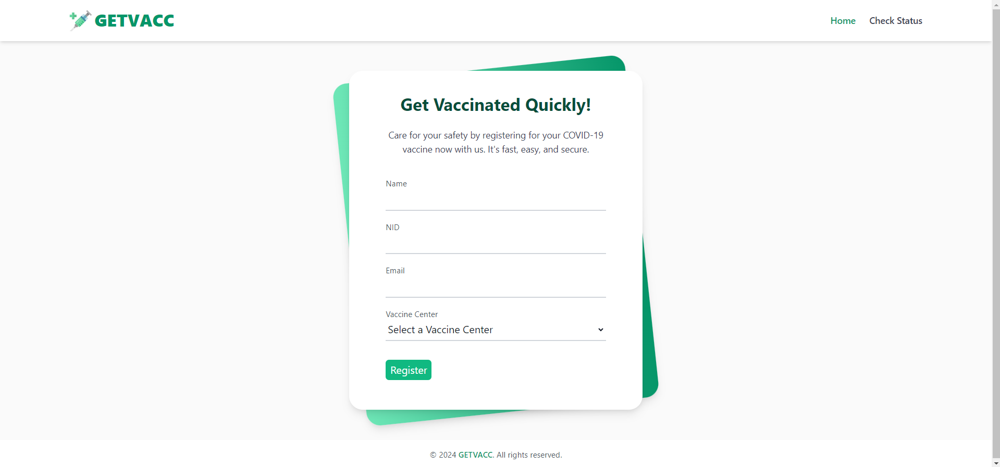

# 🏥 COVID Vaccine Registration System



A simple COVID vaccine registration system built using **Laravel 10**. This application allows users to register for the COVID vaccine, select a vaccination center, and check their vaccination status using their National ID (NID). Vaccination schedules are managed on a "first come, first serve" basis, and users are notified via email the night before their scheduled vaccination date.

## ✨ Features

- **User Registration**: Users can register for the COVID vaccine and select their vaccination center.
- **Vaccination Center Limits**: Each center has a daily limit of users it can serve, and the system distributes users based on availability.
- **Vaccination Status**: Users can check their vaccination status by entering their NID.
- **Email Notifications**: Users are notified via email the night before their scheduled vaccination date.
- **AJAX-based Search**: The vaccination status search is done without page reload using AJAX for a better user experience.

---

## 🚀 Getting Started

### 📋 Prerequisites

To run this project, you need to have the following installed:

- PHP (version 8.1+)
- Composer
- Laravel 10
- MySQL (or any other compatible database)
- Node.js & NPM (for front-end dependencies)
- Mail server configuration (for email notifications)

### 🔧 Installation Instructions

1. **Clone the Repository**

   ```bash
   git clone https://github.com/ahmad-cit22/vaccine-registration-laravel.git
   cd vaccine-registration-laravel
   ```

2. **Install Dependencies**

   Run the following command to install all the project dependencies:

   ```bash
   composer install
   ```

3. **Set Up Environment File**

   Copy the example environment file and modify it according to your local setup:

   ```bash
   cp .env.example .env
   ```

   Then, open the `.env` file and update the following configurations:

   - **Database**: Set up your database credentials (`DB_DATABASE`, `DB_USERNAME`, `DB_PASSWORD`).
   - **Mail**: Configure your mail driver for sending emails. You can use services like Mailgun, SMTP, etc.
   - **APP_URL**: Set the app URL to your local development URL, e.g., `http://localhost:8000`.

4. **Generate Application Key**

   ```bash
   php artisan key:generate
   ```

5. **Run Migrations and Seed Vaccine Centers**

   Run the following command to create the necessary database tables and prepopulate the vaccine centers:

   ```bash
   php artisan migrate --seed
   ```

6. **Run the Application**

   Start the Laravel development server by running the command:

   ```bash
   php artisan serve
   ```

   The application will now be running at `http://localhost:8000`.

7. **Build Frontend Assets**

   To compile the necessary frontend assets, run:

   ```bash
   npm run dev
   ```

---

## ⚡ Optimizing Performance

- **Database Indexing**: The NID column in the users table has been indexed to optimize the search functionality. This significantly reduces search time.
- **AJAX for Search**: The vaccination status search uses AJAX to load the result dynamically without a page reload, improving user experience and reducing server load.
- **Queued Email Jobs**: The email notifications are sent asynchronously by implementing queued jobs that handle email sending processes in the background which improves the performance of scheduling & reminder-sending process.

### Optimization Notes

- **Additional Caching**: If given more time, I would implement caching mechanisms for the search and registration pages to reduce database hits and further optimizing performance.

---

## 🧪 Tests

This project includes various tests to ensure the correct & smooth functionality with reliability of the system. The implemented tests are mentioned below:

### 1. VaccinationRegistrationTest
- **Purpose:** Tests the vaccination registration process.
- **Description:** Ensures that users can register for vaccination successfully with valid data and that appropriate validation messages are returned for invalid input.

### 2. VaccinationSearchTest
- **Purpose:** Tests the vaccination status checking/searching functionality.
- **Description:** Verifies that users can search for their vaccination status using their respective NID. Besides checking input validation process, it also ensures the correct responses for registered, non-registered, scheduled, not scheduled & vaccinated users.

### 3. VaccinationSchedulerTest
- **Purpose:** Tests the scheduling of vaccinations.
- **Description:** Validates that the `VaccinationScheduler` service schedules vaccinations correctly for the next available weekday while adhering to the daily limit set for each vaccine center. It also checks if the notification is sent properly to users when scheduled.

### 4. VaccinationReminderTest
- **Purpose:** Tests the sending of vaccination reminders.
- **Description:** Checks that reminder notifications are sent to users whose vaccinations are scheduled for the next day.

### 5. CommandsTest
- **Purpose:** Tests the command-line functionalities for scheduling vaccinations and sending reminders.
- **Description:** Ensures that the artisan commands run successfully and perform the expected operations without errors.

### 6. VaccinationSchedulerUnitTest
- **Purpose:** Tests the private method of the `VaccinationScheduler` service.
- **Description:** Validates the logic for finding the next available weekday, ensuring it correctly skips the weekends.

### Running Tests
To run the provided tests, you can use the following command:

```bash
php artisan test
```
---

## 📈 Future Enhancements

If an additional requirement for sending SMS notifications along with the email notifications is introduced, the following changes would be required:

1. **SMS Service Integration**: Adding a third-party SMS service like Twilio or Nexmo.
2. **Notification Logic Update**: Extending the notification logic in the `SendVaccinationReminder` command to send SMS in addition to emails. This would require:
   - Adding a method in the command class for sending SMS.
   - Ensuring that each user’s phone number is captured during registration and stored in the database.
3. **Environment Configuration**: Adding SMS API credentials to the `.env` file, such as `TWILIO_SID`, `TWILIO_AUTH_TOKEN`, and `TWILIO_FROM`.

Here is a brief outline of how I could implement it in the `SendVaccinationReminder` command class:

```php
// Adding SMS sending logic inside the command class

public function handle()
{
    // Existing email sending logic goes here

    // I'd put the SMS sending logic here
    if (config('services.twilio.enabled')) {
        $this->sendSms($user->phone, $smsMessage);
    }
}

// Sending sms function
protected function sendSms($phone, $message)
{
    $twilio = new Client(config('services.twilio.sid'), config('services.twilio.token'));

    $twilio->messages->create($phone, [
        'from' => config('services.twilio.from'),
        'body' => $message,
    ]);
}
```

---

## 📝 Conclusion

This project demonstrates a basic but standard COVID vaccine registration system built with Laravel 10, following the best practices, SOLID principles and Laravel’s conventions. The application is optimized for performance and can be scaled further with more time and resources, inshaAllah.

Let me know if you have any issues running the application, and feel free to give any suggestions you have!
